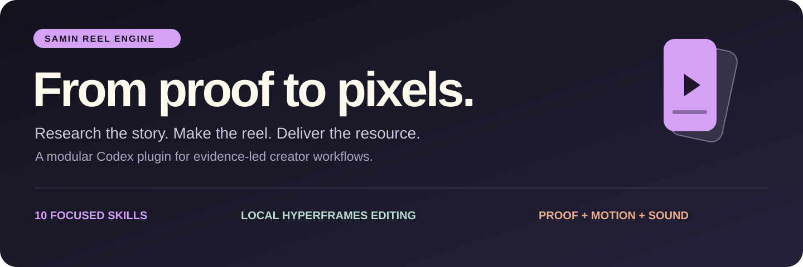
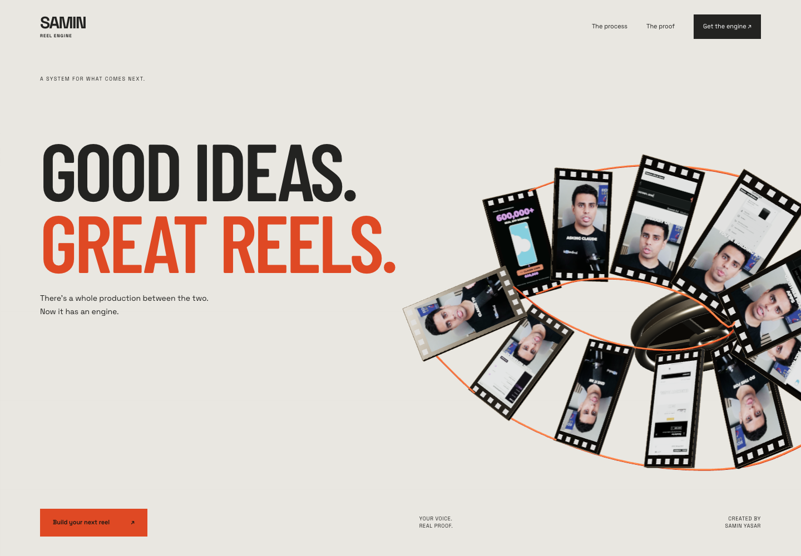
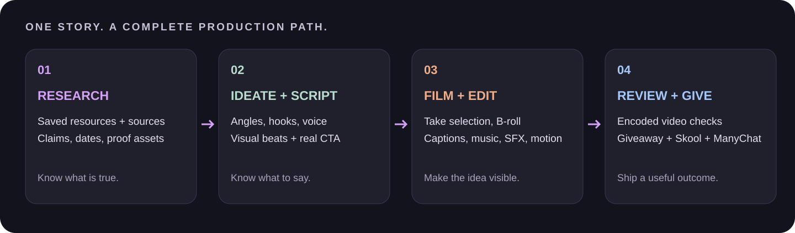

<p align="center"></p>

<p align="center">
  <strong>A research-to-reel production system for Codex.</strong><br>
  Real evidence. Your voice. Fast edits. Useful giveaways.
</p>

<p align="center">
  <a href="#see-it-in-motion">Watch the demo</a> ·
  <a href="#get-started">Install</a> ·
  <a href="docs/capabilities.md">Capability guide</a> ·
  <a href="docs/workflow.md">Workflow</a> ·
  <a href="docs/integrations.md">Integrations</a>
</p>

Samin Reel Engine turns a promising story into a complete creator workflow: research the claim, develop an angle, write a filmable script, gather proof, edit the recorded take, review the actual output, and prepare the resource promised in the CTA.

It combines **ten focused skills** with a **local HyperFrames editing runtime**, practical source-finding recipes, reusable JSON contracts and explicit creative checks. Skills load by stage, so an agent can repair one weak visual or work through the complete pipeline.

## Explore the interactive website

[**Visit the Reel Engine 3D experience →**](https://open-yoga-hpnv.here.now/?v=2)



Explore the pipeline, watch the actual reel, choose your starting point and sign up for product updates. Built with [Astra Designer](https://github.com/Samin12/astra-designer). [Website source and buyer-journey walkthrough](https://github.com/Samin12/astra-designer/tree/main/examples/reel-engine-v2).

## See it in motion

<table>
<tr>
<td width="44%" align="center"></td>
<td valign="top">
<h3>Clear immediately. Moving immediately.</h3>
<p>The Mobbin demo begins with the presenter below the graphic for <strong>0.5 seconds</strong>, then changes useful app views roughly every <strong>0.7–0.8 seconds</strong>.</p>
<p>The subject, count and benefit remain understandable while the visuals move. Native app motion, real source screens, short captions, a continuous music bed and purposeful sound effects carry the edit.</p>
<p><strong>This is an actual rendered example.</strong> The GIF is silent; use the full MP4 to hear the mix.</p>
<p><a href="https://github.com/Samin12/samin-reel-engine-plugin/releases/tag/v0.3.0">Watch or download the full 49-second reel →</a></p>
<p><a href="docs/showcase.md">Read the editing decisions and verification limits</a></p>
</td>
</tr>
</table>

## One connected pipeline



| Stage | What you get |
|---|---|
| **Research** | Saved-resource leads plus fresh primary sources; dates, claim checks, source links and visual opportunities. |
| **Ideation** | A specific hook, audience payoff, visual angle and a giveaway worth asking for. |
| **Scripting** | Spoken copy calibrated to your own examples, filming-length checks and a visual job for each beat. |
| **Intake** | Word-timed transcription, take candidates, reviewed cuts and an editable source-to-output map. |
| **Assets** | Relevant posts, GitHub READMEs, docs, screenshots, screen recordings and real resource previews with provenance. |
| **Generation** | A bounded brief for missing explanatory images or motion, using an available provider; generated material stays distinguishable from evidence. |
| **Editing** | Vertical compositions, presenter/split/full-screen layouts, crops, zooms, captions, music, SFX and deterministic renders. |
| **Review** | A cold first-frame check, source-fit/readability checks, motion and audio observations, and timecoded repairs against the actual export. |
| **Giveaways** | Real prompts, checklists or resource packs that match the spoken promise and CTA keyword. |
| **Delivery** | Skool post and ManyChat handoff packets, release files and a verifiable production record. Publication is a separate action. |

## What makes the edit different

- **Proof follows the sentence.** Every insert answers a viewer question and identifies the exact visible detail that supports the spoken claim. A relevant word in a screenshot is not enough.
- **The first frame explains the idea.** Subject, benefit and relationship must be visible together at phone size. Animation cannot hide essential context until later.
- **The intro earns its motion.** Prefer unchanged image holds of 0.5 seconds or less; cap them at 1 second. Tiny zooms and caption-only changes do not qualify as meaningful intro action.
- **Music and SFX are part of the brief.** The plugin build command requires an actual music track unless the user explicitly opts out. Effects should read clearly without masking speech.
- **Speech stays human.** Remove reviewed quiet gaps and retime words, captions and outer cues while keeping the voice at 1×. Recheck word boundaries and effect tails.
- **Real motion comes first.** Prefer relevant typing, scrolling, interface changes and demonstrations. Reframe still proof when it helps; preserve its readable detail.
- **The resource exists before the promise.** Prepare the actual giveaway, then validate the keyword, links and community handoff.
- **An encode is not a creative approval.** Structural checks, sampled frames, full playback and user acceptance are recorded separately.

## Get started

You need Codex with plugin support, Git, Python **3.11**, Node.js and FFmpeg/FFprobe. Provider accounts are only needed for the stages that use them.

```bash
git clone https://github.com/Samin12/samin-reel-engine-plugin.git
cd samin-reel-engine-plugin

python3.11 -m venv .venv
source .venv/bin/activate
python -m pip install -r production/requirements.txt
npm ci --prefix production/editor

python tools/build-plugin.py
python plugins/samin-reel-engine/scripts/reel.py --project "$PWD" configure
codex plugin marketplace add "$PWD"
codex plugin add samin-reel-engine@samin-reel-engine
```

Start a new Codex task to load the installed skills. Keep the virtual environment active for CLI commands. The dependency pins capture the tested Python 3.11 setup; they are not a claim of universal platform compatibility.

For local speech transcription, also install `production/requirements-intake.txt` and supply or download the Whisper model required by the intake command. See [setup and first-run checks](docs/setup.md).

**Bring your own scripts and footage.** This public repository contains no private voice corpus, saved bookmarks, raw filming batches, account data or credentials. Add your own voice samples locally before requesting a voice match. The finished showcase is included as a demonstration, not as a raw asset library.

## Ask it to work

**Start from an idea**

> Use Samin Reel Engine. Research this topic using my saved resources and primary sources from the last 30 days. Propose three angles, then prepare a script, proof-asset queue and a real giveaway for the strongest angle.

**Turn a filmed batch into a reel**

> Use reel director. Here are my footage, scripts and reference. Select the take, preserve my actual voice, find supporting real-world B-roll and make a vertical review cut with captions, music and SFX.

**Repair a weak edit**

> Use reel review. Inspect this export at phone size. Check the first frame, first-second motion, source relevance, caption placement, music and SFX. Make timecoded repairs and recheck the output.

**Prepare the giveaway handoff**

> Prepare the actual resource, a matching Skool post and a ManyChat keyword packet. Validate the links and record what still needs configuration before publishing.

## Ten skills, loaded as needed

| Skill | Focus |
|---|---|
| [`reel-director`](plugins/samin-reel-engine/skills/reel-director/SKILL.md) | State, stage routing and the complete workflow |
| [`reel-research`](plugins/samin-reel-engine/skills/reel-research/SKILL.md) | Sources, bookmarks, facts and visual leads |
| [`reel-ideation`](plugins/samin-reel-engine/skills/reel-ideation/SKILL.md) | Hooks, angles, viewer value and giveaway promises |
| [`reel-script`](plugins/samin-reel-engine/skills/reel-script/SKILL.md) | Your supplied voice examples and filmable copy |
| [`reel-intake`](plugins/samin-reel-engine/skills/reel-intake/SKILL.md) | Transcription, take selection and timing |
| [`reel-assets`](plugins/samin-reel-engine/skills/reel-assets/SKILL.md) | Real-source B-roll and visible proof |
| [`reel-generate`](plugins/samin-reel-engine/skills/reel-generate/SKILL.md) | Explanatory asset generation and inspection |
| [`reel-edit`](plugins/samin-reel-engine/skills/reel-edit/SKILL.md) | Composition, captions, motion, music and SFX |
| [`reel-review`](plugins/samin-reel-engine/skills/reel-review/SKILL.md) | Actual-output judgment and repair |
| [`reel-deliver`](plugins/samin-reel-engine/skills/reel-deliver/SKILL.md) | Resource packs, Skool and ManyChat handoffs |

## Local tools underneath the skills

The runner exposes a fixed set of commands rather than arbitrary shell dispatch:

```bash
python plugins/samin-reel-engine/scripts/reel.py doctor
python plugins/samin-reel-engine/scripts/reel.py run pipeline -- --help
python plugins/samin-reel-engine/scripts/reel.py run capture -- --help
python production/editor/edit.py build --help
python plugins/samin-reel-engine/scripts/reel.py run check -- --help
```

Research collection, pipeline validation, script measurement, intake, take preparation, timing remaps, evidence capture, composition building, rendering, mastering, editorial checks, a review player and ManyChat packet preparation are included. [Browse the commands and their boundaries](docs/capabilities.md).

> **Integration boundary:** Eden, Drive, Heptabase, generation providers, Skool and project-management apps use the capabilities and authenticated accounts available to your agent. They are not bundled account connections. The included ManyChat adapter prepares packets and optionally reads metadata; it does **not** author flows or send subscriber messages. HyperFrames is the local renderer; a HeyGen account is not required for that route.

## Built for repeatable agent work

The playbooks contain ordered procedures, fallback options, concrete pass/fail examples and JSON review records. They are designed to reduce guesswork for less capable models. Creative judgment still needs checking: **no model-equivalence or retention guarantee is claimed**.

Useful starting points:

- [Operator runbook](plugins/samin-reel-engine/references/operator-runbook.md)
- [Visual-evidence rules](plugins/samin-reel-engine/references/visual-evidence.md)
- [Shot recipes and opening motion](plugins/samin-reel-engine/references/shot-recipes.md)
- [Quality procedure](plugins/samin-reel-engine/references/quality-procedure.md)
- [Creative-review template](plugins/samin-reel-engine/templates/creative-review.json)
- [Asset-index schema](production/asset-index.schema.json) and [editorial-map schema](production/editorial-map.schema.json)

## Repository map

```text
plugins/samin-reel-engine/   10 skills, shared playbooks, templates and runner
production/                 Local intake, capture, edit and review runtime
skill/                      Maintained playbooks and research/pipeline helpers
tools/hold-your-voice/       Voice-profile and draft-check helper
voice/                      Instructions for your local, ignored voice samples
docs/                       Setup, capabilities, workflow and visual showcase
```

This is the public distribution. Production data belongs in your local workspace. Historical Council/Mobbin paths in playbooks describe worked examples; private audit records and raw media are not bundled. Use the public [showcase](docs/showcase.md) and your own asset/timeline records.

Public/source-available, with rights retained unless separately licensed. See [LICENSE](LICENSE) and [third-party notices](THIRD_PARTY_NOTICES.md).
